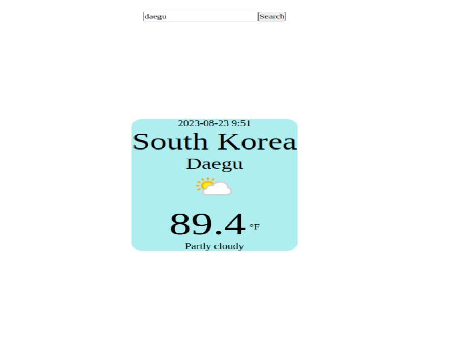

# weather-app
Welcome to WeatherApp! This is a simple web application that utilizes a weather API to fetch weather data for a searched city and displays it on a card.

## Overview

WeatherApp is a project I developed to practice working with APIs and dynamically updating the content of a web page. The app takes user input for a city and uses the weather API to retrieve current weather information. The fetched data is then displayed on a card format on the webpage.

## Features

- **Weather Data:** Enter the name of a city to retrieve real-time weather information.

- **API Integration:** Utilizes the WeatherAPI to fetch weather data in JSON format.

## Usage

1. Enter the name of a city in the search bar.
2. Click the "Search" button.
3. The weather data for the entered city will be displayed on a card.

## Technologies Used

- HTML
- CSS
- JavaScript
- WeatherAPI (https://www.weatherapi.com/api-explorer.aspx)

## Screenshots
